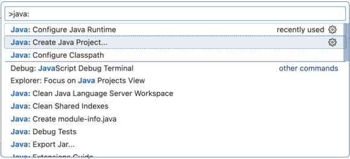
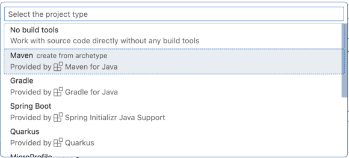
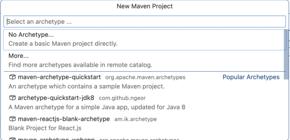
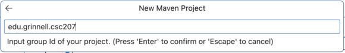
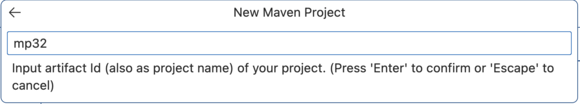
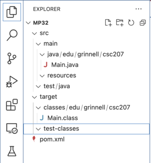
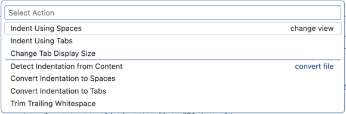

# {{ page.title }}

While we will often provide you with pre-configured projects on GitHub that you will fork, clone, and import into VSCode, there are times you may need to set up your own project on both GitHub and VSCode. This document provides you with the approach that we'd prefer you use in the course. 

For the example in this discussion, we'll assume that you want to call the project `mp32` (for the 32nd mini-project).

This semester, we will be using Maven as our build manager. Hence, these instructions focus on building projects using Maven.

## A quick overview

You will need to work in at least three environments to set up a new project. 

* Within **VSCode**, you'll create the project and associated files. That includes adding and removing some files as well as configuring the project.
* On **GitHub**, you'll set up a repository for the project. 
* On **the command line** (aka **the terminal**), you'll prepare to use GitHub, add the files, and the connect the local repository to the GitHub repository.

## 1\. Initial Maven setup in VSCode

Open the command prompt with <kbd>Shift</kbd>-<kbd>Ctrl</kbd>-<kbd>P</kbd>. (You'll use <kbd>Shift</kbd>-<kbd>Command</kbd>-<kbd>P</kbd> on the Mac.)

Start typing "Java: Create Java Project...".  You'll usually find that the command appears near the top of the contextual menu, so select it when you can.



VSCode will prompt you to select the project type. Select "Maven".



VSCode will prompt you to select an archetype. Select "No Archetype".



VSCode will prompt you to select the group id of your project. Enter "edu.grinnell.csc207". (We will almost always use "edu.grinnell.csc207" as our group id.)



VSCode will prompt you for an artifact name. Use the name of your project (`mp32` in this case).

.

VSCode will then prompt you for a directory. Select the directory you're using for CSC207 work.

Finally, VSCode will let you know that it created the project.

![A VSCode dialog box that reads "Maven project [mp32] is created under: /Users/rebelsky/CSC207"](../images/project-setup/maven-project-created.png)

Click the close box (the "x" in the upper-right-hand corner).

We want to switch to this project, so open it in VSCode.

## 2\. Setting up files

If you expand all the tabs in your project, you should see something like the following.



We're going to make lots of changes.

### 2\.1\. Create a `README.md` file

Every project should have a `README.md` file that gives basic information on the project. For this class, I ask that you include your name, the location of the GitHub repo, citations/acknowledgements, and any other information you think would be useful for the grader or other reader of your code.

```
# mp32 - The best MP ever!

Another mini-project by Samuel A. Rebelsky

This mini-project may be found at https://github.com/rebelsky/mp32
```

### 2\.2\. Add the `csc207-checks.xml` file

I'd like you to do style checking in your projects. (If you don't, your graders will, so you might as well get things right.) We'll use the file [`csc207-checks.xml`](../files/csc207-checks.xml). Copy that into your project at the top level (the same level as `pom.xml` and `README.md`. Please don't edit that file.

### 2\.3\. Add a `.gitignore` file

Each Git repository should have a `.gitignore` file that gives names and patterns of files that should not be added to the repository. Please copy [this one](../files/gitignore) to your project. Feel free to update it.

### 2\.4\. Remove `Main.java`.

`Main.java` is a sample file that Maven creates. You shouldn't need it. Delete it.

### 2\.5\. Add at least one Java file

Since you'll be building some Java files, add at least one (in the same directory as Main.java).

## 3\. Edit `pom.xml`

The `pom.xml` (Project Object Model) file contains information on your project for Maven. VSCode also pulls information from that file (at least if you let it). Here's what your initial file should look like.

```
<?xml version="1.0" encoding="UTF-8"?>
<project xmlns="http://maven.apache.org/POM/4.0.0"
         xmlns:xsi="http://www.w3.org/2001/XMLSchema-instance"
         xsi:schemaLocation="http://maven.apache.org/POM/4.0.0 http://maven.apache.org/xsd/maven-4.0.0.xsd">
    <modelVersion>4.0.0</modelVersion>

    <groupId>edu.grinnell.csc207</groupId>
    <artifactId>mp32</artifactId>
    <version>1.0-SNAPSHOT</version>

    <properties>
        <maven.compiler.source>17</maven.compiler.source>
        <maven.compiler.target>17</maven.compiler.target>
    </properties>

</project>
```

You should have a different `artifactId` (whichever you selected when setting up the project). 

If your source and target aren't at least 17, you may need to update them. Please talk to one of the course staff for help.

### 3\.1\. Set the indent to two spaces

We will generally use a two-space indent in this course. That indentation is more important for Java code than XML, but you might as well do it here, too.

In the lower-right-hand corner of the window, you should see some file information. Click on "Spaces: 4". (If you don't see "Spaces: 4", you may see "Tab Size: 4".


A menu will appear at the top. Select "Indent Using Spaces".



Another menu will appear at the top. Select the number 2.

### 3\.2\. Add a source encoding

It's polite to indicate how the files in your project are encoded (ASCII, UTF-8, UTF-16, etc.). We'll be using UTF-8. Add the following line to the `properties` section.

```
    <project.build.sourceEncoding>UTF-8</project.build.sourceEncoding>
```

That section should now look like this.

```
  <properties>
    <maven.compiler.source>17</maven.compiler.source>
    <maven.compiler.target>17</maven.compiler.target>
    <project.build.sourceEncoding>UTF-8</project.build.sourceEncoding>
  </properties>
```

### 3\.3\. Add support for JUnit

We'll be using JUnit for testing programs. You need to tell Maven about JUnit. Add the following to your file, under properties.

```
  <dependencies>
    <dependency>
      <groupId>org.junit.jupiter</groupId>
      <artifactId>junit-jupiter-engine</artifactId>
      <version>5.9.1</version>
      <scope>test</scope>
    </dependency>
  </dependencies>
```

### 3\.4\. Add support for `checkstyle`

`checkstyle` is an application that, perhaps unsurprisingly, checks whether your Java code meets some standard style guidelines. Since you will be graded on your code's style, you will find it beneficial to check it before submitting. Hence, we'll add a section to include and configure `checkstyle`.

```
  <build>
    <pluginManagement>
      <plugins>
        <plugin>
          <groupId>org.apache.maven.plugins</groupId>
          <artifactId>maven-checkstyle-plugin</artifactId>
          <version>3.4.0</version>
          <configuration>
            <configLocation>csc207-checks.xml</configLocation>
          </configuration>
          </plugin>
      </plugins>
    </pluginManagement>
  </build>
```

### 3\.5\. Add information about your main class

If you have classes that provide a `main` method, Maven permits you to specify which of those classes is run when someone types `mvn exec:java`. Do so by adding the following lines to the "plugins" section of `pom.xml`, substituting the name of your main class for `Main`.

```
```

### 3\.6\. Add more information about your main class

### 3\.7\. A sample `pom.xml`

Here's what `pom.xml` might look like after you've done all that.

```
<?xml version="1.0" encoding="UTF-8"?>
<project xmlns="http://maven.apache.org/POM/4.0.0"
  xmlns:xsi="http://www.w3.org/2001/XMLSchema-instance"
  xsi:schemaLocation="http://maven.apache.org/POM/4.0.0 http://maven.apache.org/xsd/maven-4.0.0.xsd">
  <modelVersion>4.0.0</modelVersion>

  <groupId>edu.grinnell.csc207</groupId>
  <artifactId>mp32</artifactId>
  <version>1.0-SNAPSHOT</version>

  <properties>
    <maven.compiler.source>17</maven.compiler.source>
    <maven.compiler.target>17</maven.compiler.target>
    <project.build.sourceEncoding>UTF-8</project.build.sourceEncoding>
  </properties>

  <dependencies>
    <dependency>
      <groupId>org.junit.jupiter</groupId>
      <artifactId>junit-jupiter-engine</artifactId>
      <version>5.9.1</version>
      <scope>test</scope>
    </dependency>
  </dependencies>

  <build>
    <pluginManagement>
      <plugins>
        <plugin>
          <groupId>org.apache.maven.plugins</groupId>
          <artifactId>maven-checkstyle-plugin</artifactId>
          <version>3.4.0</version>
          <configuration>
            <configLocation>csc207-checks.xml</configLocation>
          </configuration>
          </plugin>
      </plugins>
    </pluginManagement>
  </build>
</project>
```

## 4\. Turn your Project into a local Git repository

If you don't yet have a terminal open in VSCode open one up with Terminal -> New Terminal.

Navigate to the top level of your project. (Ideally, VSCode has placed you in the top level of your project.) If you type `ls -a` in the directory, you should see something like the following.

```
$ ls -a
.                       .gitignore              csc207-checks.xml       src
..                      README.md               pom.xml                 target
```

### 4\.1\. Initialize the local Git repository

Type `git init`. That should initialize a local Git repository in the current directory.

```
$ git init
Initialized empty Git repository in /Users/rebelsky/CSC207/mp32/.git/
```

### 4\.2\. Add files to the repository

Add each of the files we've created for your project. We'll add the whole `src` tree since it should only have files we've created.

```
git add .gitignore
git add csc207-checks.xml
git add README.md
git add pom.xml
git add src
```

Please don't use `git add .`, even though you may often see those instructions on the Interweb. It's always safer to add files one at a time.

### 4\.3\. Check what you've added.

Speaking of safety, before committing, it's always best to verify that you've only added the files you want. Use `git status` to check.

```
$ git status
On branch main

No commits yet

Changes to be committed:
  (use "git rm --cached <file>..." to unstage)
        new file:   .gitignore
        new file:   README.md
        new file:   csc207-checks.xml
        new file:   pom.xml
        new file:   src/main/java/edu/grinnell/csc207/TwoToTheFifth.java
```

You will likely see different files under `src`, depending on what you've added.

### 4\.4\. Commit the changes

Yay! You're ready to set up the initial repository.

```
$ git commit -m "Initial commit"
[main (root-commit) e73cbd6] Initial commit
 5 files changed, 276 insertions(+)
 create mode 100644 .gitignore
 create mode 100644 README.md
 create mode 100644 csc207-checks.xml
 create mode 100644 pom.xml
 create mode 100644 src/main/java/edu/grinnell/csc207/TwoToTheFifth.java
$ git status
On branch main
nothing to commit, working tree clean
```

## 5\. Create a GitHub repository

Before we can upload our repository to GitHub, you must create an empty GitHub repository for the rpoject.

a\. Navigate to <https://github.com> and log in.

b\. At the left, you should see a list of repositories. Click the **New** button.

c\. Fill in the name of the repository. I'd suggest something short and sweet, like "mp32".

d\. Fill in a short description. I'd suggest something like "Mini-project 32 for CSC-207 2024Fa".

e\. Make it public.

f\. Do not add a README.

g\. Do not add a .gitignore.

h\. Do not add a license. (You might want to add one later.)

i\. Click "Create Repository".

j\. You should see a screen giving some setup instructions. You're done on GitHub for the time being.

## 6\. Connect the local and remote repositories

We're almost done! We just need to connect the repositories we created in the previous steps.

Fortunately, GitHub has already given us instructions.

```
git remote add origin git@github.com:USER/REPO.git
git branch -M main
git push -u origin main
```

You will need to substitute in your own username and repo name.

Once you've pushed, you should reload your repository page on GitHub to make sure the files are here.

Wasn't that fun?

## Some final notes

You may be asking yourself, "Why don't we just have a template that we copy and change?" And that's definitely a good question. When you feel ready to set up a template, you can (and should) do so. But as you're learning, it's good to do all the steps and reflect on the rationale for each step.

Good luck! And have fun!
