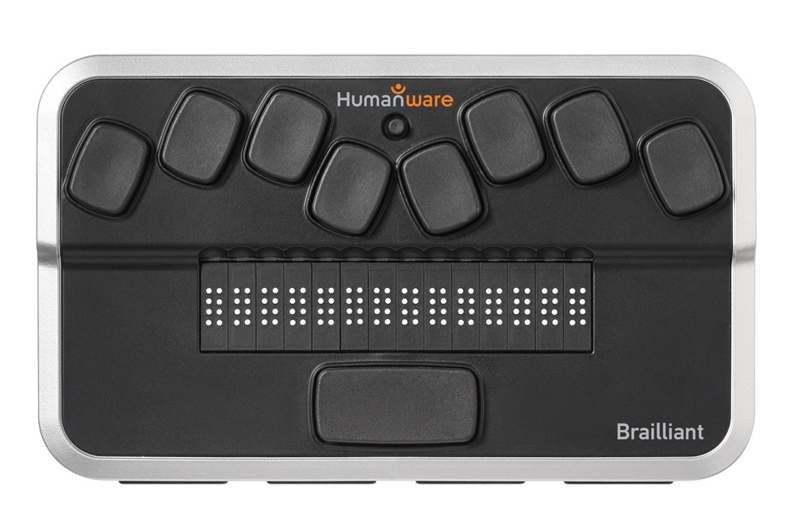
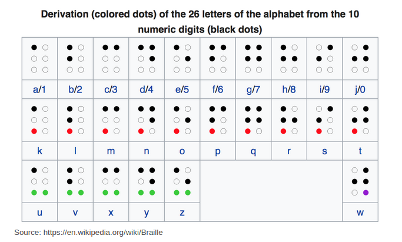

_This assignment is adapted from the Including A11y in CS project
entitled "[Braille Binary Tree](https://accessibilityeducation.github.io/braillebinarytree.html)"._

Introduction
------------

Braille is a tactile writing system used by people with visual impairments. Traditionally, braille was written by embossing paper. Today, people typically use a braille writer, such as a portable braille notetaker or computer that prints with a braille embosser. As for reading computer screens, braille users have the option of using refreshable braille displays. What makes it refreshable is whenever the user moves their cursor through keyboard or voice commands, the display updates the dots in the braille cells.


(Figure 1) Person using a screen reader, by [Elypse at stock.adobe.com](https://stock.adobe.com/contributor/200852236/elypse).



(Figure 2) An example of a braille display, from PaTTAN

In this project, you will explore mechanisms for representing text in standard Braille and converting between Braille and other representations.

About Braille
-------------

As you know, computers encode all information, including strings, using binary enncoding.

Braille was the first writing system with binary encoding. The system as devised by Louis Braille consists of two parts:

* Character encoding that mapped characters of the alphabet to six bits (0's and 1's).
* The physical representation of those six-bit characters with raised dots in a braille cell.

Within an individual cell, the dot positions are arranged in a three by two grid. A raised dot can appear in any of the six positions, producing sixty-four possible patterns, including one in which there are no raised dots.

A braille letter is commonly described by listing the positions where dots are raised. The positions are universally numbered, from top to bottom, as 1 to 3 on the left column and 4 to 6 on the right column. For example, an "M" is represented with cells 1, 3, 4 raised and 2, 5, 6 lowered (&#10253;).

```
1 4
2 5
3 6
```

(Figure 3) Braille cell numbering

Here's the full French/English (I'd call it "European") braille description, showing how Braille divided letters into "decades" of ten letters.  You'll notice that "W doesn't follow the pattern; that's because French did not use the letter W when Braille developed his system.



(Figure 4) The alphabetic letters in English braille, taken from [Wikipedia](https;//en.wikpedia.org/Braille)

If you're wondering about the accented letters that French uses, you can find them where the accented letters are, you can find them in [French Braille](https://en.wikipedia.org/wiki/French_Braille).

In any case, we will need to think of braille encodings as six bits, numbered from 1 to 6, left to right.  For example, M is 101100.

Braille as a binary tree
------------------------

Suppose we were writing a program that helps someone learn braille.  How might we efficiently store a table that allows us to convert a braille letter to an alphabetic letter?

One approach would be to use a binary tree, one in which a 1 in the input means "go left" and a 1 in the input means "go right".  The leaves of the tree will be the values that correspond to the bits we followed to get there.  For example, if we start at the root and follow edges in the sequence right (1), left (0), right (1), right (1), left (0), and left (0), we should reach the letter "M"

Note that in these "Bit trees", the interior nodes have no associated values; only the leaves have values.  

Since English braille uses only six bits (and always uses six bits), a binary tree for English braille should have seven levels.

In contrast, if we were using a bit tree to convert ASCII characters to braille, we might need eight (7-bit ASCII) or nine (8-bit ASCII) levels.

Bit trees
---------

Create a class, `BitTree`, intended to store mappings from bits to values.

* A constructor, `BitTree(int n)`, that builds a tree that will store
  mappings from strings of n bits to strings.  We'd build our tree for
  mapping braille to ASCII with `new BitTree(6)`.  We'd build our tree
  for mapping ASCII to braille with `new BitTree(7)` or `new BitTree(8)`.
  _Do not create nodes in the tree until they are needed._
* A method, `set(String bits, String value)`, that follows the path 
  through the tree given by `bits` (adding nodes as appropriate) and
  adds or replaces the value at the end with `value`.  `set` should
  throw an exception if `bits` is the inappropriate length or contains
  values other than 0 or 1.
* A method, `String get(String bits)`, that follows the path through the
  tree given by `bits`, returning the value at the end.  If there is
  no such path, or if `bits` is the incorrect length, `get` should
  throw an exception.
* A method, `void dump(PrintWriter pen)`, that prints out the contents
  of the tree in CSV format.  For example, one row of our braille
  tree will be "101100,M" (without the quotation marks).
* A method, `void load(InputStream source)`, that reads a series of
  lines of the form `bits,value` and stores them in the tree.

You will likely find it useful to create a `BitTreeNode` class and,
perhaps, a `BitTreeLeaf` class (a subclass of `BitTreeNode`?).

Braille trees
-------------

Create a class `BrailleASCIITables`, that provides the following
static methods:

* `String toBraille(char letter)`, which converts
  an ASCII character to a string of bits representing the
  corresponding braille character..
* `String toASCII(String bits)`, which converts a string of bits
  representing a braille character to the corresponding ASCII character.
* `String toUnicode(String bits)`, which converts a string of bits
  representing a braille character to the corresponding [Unicode braille character](https://en.wikipedia.org/wiki/Braille_Patterns) 
  for those bits.  You need only support six-bit braille characters.

Within the class, you must store the translation information (from
ASCII to braille, from braille to ASCII, and from braille to Unicode)
as bit trees.  You should put the translation information in a text
file (or maybe I'll get those written in time).

Utility program
---------------

Create a Main class, `BrailleASCII`, that takes two command-line
parameters, the first of which represents the target character set
and the second of which represents the source characters, and that
translates the text.  For example,

```
$ java BrailleASCII braille hello
110010100010111000111000101010
$ java BrailleASCII ascii 110010100010111000111000101010
hello
$ java BrailleASCII unicode hello
⠓⠑⠇⠇⠕
```

Rubric
------

_Forthcoming._

Tables
------

Braille to ASCII

```
100000,A
110000,B
100100,C
100110,D
100010,E
110100,F
110110,G
110010,H
010100,I
010110,J
101000,K
111000,L
101100,M
101110,N
101010,O
111100,P
111110,Q
111010,R
011100,S
011110,T
101001,U
111001,V
101101,X
101111,Y
101011,Z
010111,W
000000, 
```

Braille to Unicode

```
000000,2800
100000,2801
010000,2802
110000,2803
001000,2804
101000,2805
011000,2806
111000,2807
000100,2808
100100,2809
010100,280A
110100,280B
001100,280C
101100,280D
011100,280E
111100,280F
000010,2810
100010,2811
010010,2812
110010,2813
001010,2814
101010,2815
011010,2816
111010,2817
000110,2818
100110,2819
010110,281A
110110,281B
001110,281C
101110,281D
011110,281E
111110,281F
000001,2820
100001,2821
010001,2822
110001,2823
001001,2824
101001,2825
011001,2826
111001,2827
000101,2828
100101,2829
010101,282A
110101,282B
001101,282C
101101,282D
011101,282E
111101,282F
000011,2830
100011,2831
010011,2832
110011,2833
001011,2834
101011,2835
011011,2836
111011,2837
000111,2838
100111,2839
010111,283A
110111,283B
001111,283C
101111,283D
011111,283E
111111,283F
```

ASCII to Braille

```
01000001,100000
01000010,110000
01000011,100100
01000100,100110
01000101,100010
01000110,110100
01000111,110110
01001000,110010
01001001,010100
01001010,010110
01001011,101000
01001100,111000
01001101,101100
01001110,101110
01001111,101010
01010000,111100
01010001,111110
01010010,111010
01010011,011100
01010100,011110
01010101,101001
01010110,111001
01010111,010111
01011000,101101
01011001,101111
01011010,101011
01100001,100000
01100010,110000
01100011,100100
01100100,100110
01100101,100010
01100110,110100
01100111,110110
01101000,110010
01101001,010100
01101010,010110
01101011,101000
01101100,111000
01101101,101100
01101110,101110
01101111,101010
01110000,111100
01110001,111110
01110010,111010
01110011,011100
01110100,011110
01110101,101001
01110110,111001
01110111,010111
01111000,101101
01111001,101111
01111010,101011
00100000,000000
```

Questions and Answers
---------------------

Do you have any hints on the `dump` method?

> Sure.  We've traversed binary trees recursively before, so you'll be doing something similar.  This time, in addition to recursing over the node, you'll also include the bit string processed so far as a parameter, and add to the string as you recurse.

> For example, if we're processing the node with bit string "0101", when we recurse on the left subtree, we'll pass in "01010" and when we recurse on the right subtree, we'll pass in "01011".

Why are the ASCII-to-Braille trees deeper than the braille to ASCII trees?

> ASCII represents more characters, so we need more bits.  We're just using a subset of the characters that ASCII represents.

How should I convert the unicode numbers to characters?

> Take a look at the `Character` class in Java.

Should I handle both lowercase and uppercase letters in converting from ASCII to braille?

> It would be nice, but it's optional.  The mapping above handles both, at least if I designed it correctly.

When using braille as input for traversing the tree, I'm using the bit string.  What should I do with ASCII?

> You could convert it to a bit string.  You could use bitwise operations.

Acknowledgements
----------------

The introductory text and the overall idea for this assignment were taken from a laboratory by the _A11y in CS_ project.  The restructuring of the assignment as multiple bit trees, the introduction of Unicode, and the conversion to Java are due to Sam Rebelsky.
